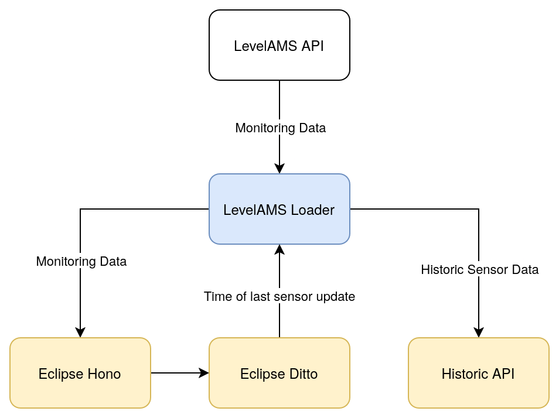
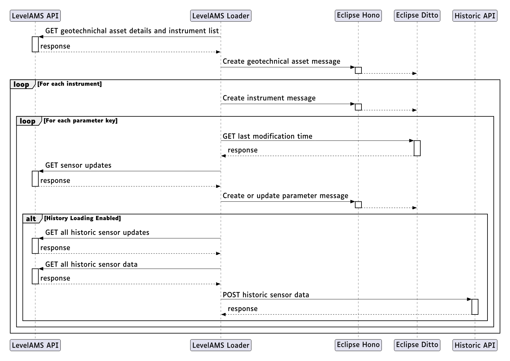

# Level AMS Loader - Developer Manual

## Architecture Overview

Level AMS Loader is an async Python application that synchronizes geotechnical monitoring data between the Level AMS API and Eclipse Ditto (digital twin platform) via Eclipse Hono (MQTT message broker).

### System Design

#### High level inter component data flow

#### Detailed component interactions

### Data Flow

1. **Fetch**: Loader requests geotechnical assets and instruments from Level AMS API
2. **Transform**: Converts API responses to Eclipse Ditto protocol messages
3. **Publish**: Sends messages to Eclipse Hono via MQTT
4. **Store**: Hono routes messages to Ditto for thing creation/updates
5. **History** (optional): Fetches historical data and sends to history API

### Tech Stack

| Component       | Technology        | Version  | Purpose                 |
| --------------- | ----------------- | -------- | ----------------------- |
| Runtime         | Python            | 3.13     | Application runtime     |
| Package Manager | uv                | Latest   | Dependency management   |
| HTTP Client     | httpx             | >=0.28.1 | Async HTTP requests     |
| MQTT Client     | amqtt             | >=0.11.3 | MQTT protocol support   |
| Data Validation | pydantic          | >=2.12.5 | Model validation        |
| Settings        | pydantic-settings | >=2.12.0 | TOML/env config loading |
| CLI Parsing     | pydantic-argparse | >=0.10.0 | CLI argument handling   |
| Logging         | loguru            | >=0.7.3  | Structured logging      |
| Coordinates     | pyproj            | >=3.7.2  | ETRS89 TM06 → WGS84     |
| Linting         | ruff              | >=0.12.5 | Code style enforcement  |
| Type Checking   | mypy              | >=1.19.0 | Static type analysis    |
